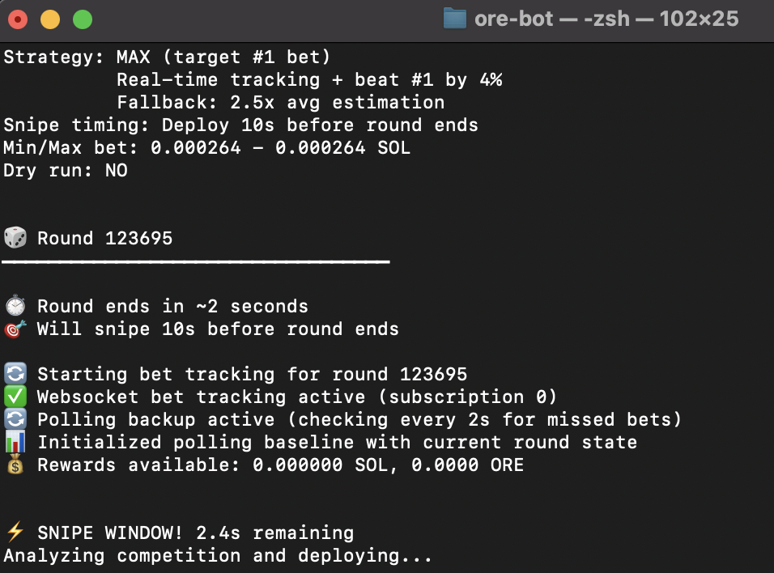

# 🚀 ore-bot: The Ultimate ore.supply Automation! 🚀

Welcome to `ore-bot`, your premier solution for dominating the ore.supply game! This bot is engineered with cutting-edge strategies to maximize your SOL winnings and secure top positions on the leaderboard. Say goodbye to manual grinding and let `ore-bot` do the heavy lifting for you!

## ✨ Key Features

*   **🎯 Precision Top Betting**: Our bot meticulously analyzes the competition and places optimal bets to ensure you're always in the lead for maximum solo wins. It's not just about betting; it's about winning big!

*   **🧠 Advanced +EV Strategy**: Leveraging sophisticated algorithms, `ore-bot` employs a proprietary Expected Value (+EV) strategy. This means every bet is calculated to give you the highest statistical advantage, turning the odds in your favor.

*   **🔮 Motherlode Prediction Engine**: Ever wonder when the next Motherlode is about to drop? `ore-bot` constantly studies historical patterns and on-chain data to predict optimal Motherlode timings. It only engages when the conditions are ripe for massive payouts, ensuring you're always there for the biggest scores! 💰

*   **⚡ Blazing Fast Transactions**: Built for speed, `ore-bot` ensures your transactions are processed with lightning-fast efficiency, giving you the edge in competitive rounds.

*   **🛡️ Secure & Reliable**: Your assets are safe with `ore-bot`. Designed with security in mind, it operates reliably to protect your investments while it works tirelessly to grow your portfolio.

*   **💸 Automated Claiming & Selling**: `ore-bot` doesn't just win; it liquidates! Automatically claims your rewards and intelligently sells them based on predefined parameters, ensuring your profits are realized without manual intervention. Set it and forget it! 🔄

## 🛠️ Setup & Installation

To get `ore-bot` up and running, follow these simple steps:

### Prerequisites

*   Node.js (v18 or higher)
*   npm (Node Package Manager)
*   A Solana wallet with SOL for transactions and fees.

### Installation

1.  **Download the repository:**

    ```bash
    git clone or manually download
    cd oremax
    ```

2.  **Install dependencies:**

    ```bash
    npm install
    ```

3.  **Configure your wallet:**

    Create a `.env` file in the `oremax` directory based on `.env.example`. You\'ll need to provide your Solana private key and RPC URL (We already have one in env for you to use if you don't have one).

    ```
    PRIVATE_KEY="YOUR_SOLANA_PRIVATE_KEY_BASE58_OR_JSON_ARRAY"
    RPC_URL="https://api.mainnet-beta.solana.com"
    # ... other configurations from .env.example
    ```

### Running the Bot

To start `ore-bot` and let it begin its automated operations, you can use the provided convenience scripts:

**For macOS/Linux users:**

1.  Make the script executable:
    ```bash
    chmod +x start.sh
    ```
2.  Run the bot:
    ```bash
    ./start.sh
    ```

**For Windows users:**

1.  Simply double-click the `start.bat` file in the `oremax` directory.

Alternatively, you can still run it directly via npm:

```bash
npm start
```



The bot will then connect to the Solana network and begin executing its advanced betting strategies. Monitor the console for real-time updates on its performance. 📈

## 📈 Performance

Join the ranks of top `ore.supply` players who trust `ore-bot` to deliver consistent, high-value returns. Our strategies are constantly refined to adapt to market changes and keep you ahead of the curve.

## 🤝 Support

For any questions or support, please refer to the documentation or open an issue on GitHub.

Happy mining with `ore-bot`! ⛏️
